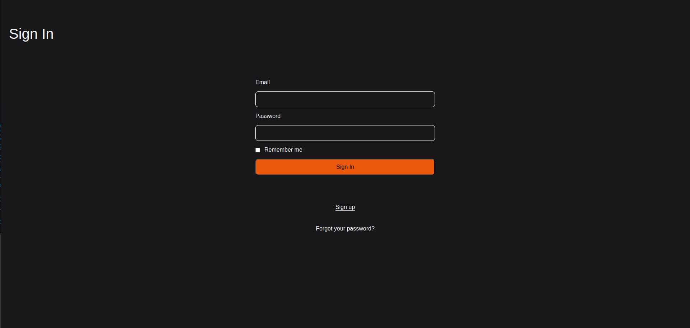

<h1 align="center"> Ruby Blog </h1>

<p align="center">
Ruby Blog is a blog-like application, where multiple users can interact though posts, by leaving comments an seeing posts other bloggers created in their timeline.<br/>
</p>

<p align="center">
  <a href="#-technologies">Technologies</a>&nbsp;&nbsp;&nbsp;|&nbsp;&nbsp;&nbsp;
  <a href="#-deploy">Run Locally</a>&nbsp;&nbsp;&nbsp;&nbsp;&nbsp;&nbsp;
</p>

<p align="center">
  
</p>


## 🚀 Technologies
- Ruby
- Rails
- HTML
- CSS
- Javascript
- Devise
- Active Record

## 💻 Run Locally

> To run the project locally you must have `RUBY` and `RAILS` on your computer
* Ruby version used: 3.4.1
* Rails version used: 8.0.1


Steps to run it locally:

1. Clone the Repository

```bash
git clone https://github.com/ssschneider/ruby-blog.git
``` 

2. Run bundler to  ensure all gems are installed

```bash
bundle i
```

3. Start the rails server

```bash
rails s
```

<br/><br/>

---
### Developed by Sarah Schneider 🖖